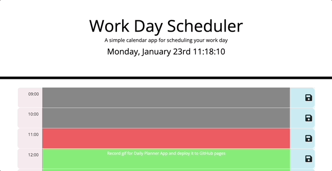

# Third-Party APIs: Work Day Scheduler

## Table of contents

- [Overview](#overview)
- [Acceptance Criteria](#acceptance-criteria)
- [Application Demo](#application-demo)
- [Links](#links)
- [Built with](#built-with)
- [What I learned](#what-i-learned)
- [Directions for future development](#directions-for-future-development)
- [Useful resources](#useful-resources)
- [Author](#author)
- [License](#license)

## Overview

- This application was built to consolidate Third Party APIs knowledge;

  - A simple calendar application that allows a user to save events for each hour of the day

  - Runs in the browser and features dynamically updated HTML and CSS powered by jQuery

## Acceptance Criteria

The app functionality:

- Displays the current day at the top of the calender when a user opens the planner

- Presents timeblocks for standard business hours when the user scrolls down

- Color-code each timeblock based on past, present, and future when the timeblock is viewed

- Allows a user to enter an event when they click a timeblock

- Save the event in local storage when the save button is clicked in that timeblock

- Persist events between refreshes of a page

- Uses a date utility library to work with date and time

## Application Demo

The following animation demonstrates the application functionality:

## Links

- You will be able to acces the app URL if you navigate into Settings → Pages inside this repository

- Or, click on this link: [Daily Planner]()

## Built with...

- HTML

- CSS

- JavaScript

- jQuery

- Moment.js

## What I learned

- Implementing DOM manipulation strategies using the jQuery library

- Building small games using JavaScript and jQuery

- Creating time-based operations using Moment

## Directions for future development

- The app functionality: do not allow user to input and record any events in the hours that have passed

## Useful Resources

- [jQuery Documentation](https://api.jquery.com/)

- [Moment.js](https://momentjs.com/)

- [HTMLTextAreaElement](https://developer.mozilla.org/en-US/docs/Web/API/HTMLTextAreaElement)

## Author

©️ Helena Gilja

- GitHub - [cyberrie](https://github.com/cyberrie)

## License

N/A
